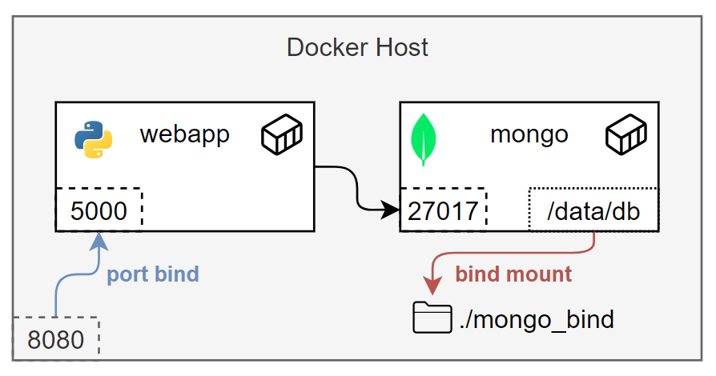
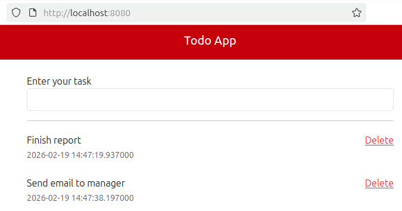

# Multi Containers App

A simple web application (todo list) composed of two containers: Flask app
(Python) and MongoDB.

You can use it to demonstrate how a multi container application works.

Run the Docker Compose command:

`docker compose up -d`

And then access <http://localhost:8080> in your browser if Docker is running
in your own machine. Otherwise, replace `localhost` with the IP address of
the host where Docker is running.

---

Based on <https://github.com/docker/multi-container-app/>
